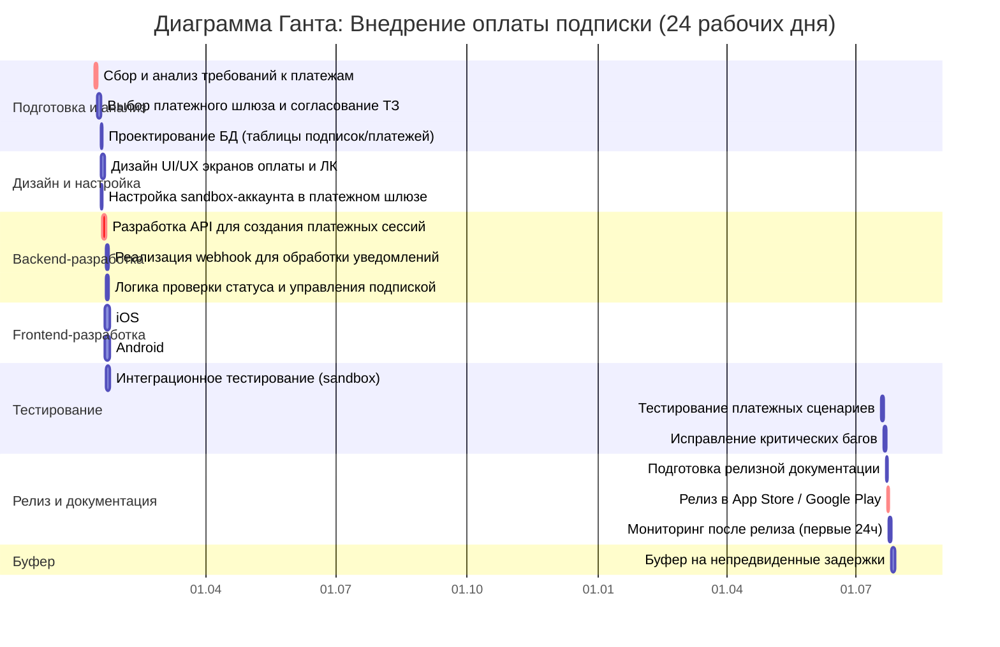

Основные проблемы в текущем управлении проектом: 
1) Отсутствие чёткого планирования и приоритизации задач: задачи хаотичны, некоторым не даны временные рамки: иконка приложения, тестирование, раздел с питанием и рецептами.
2) Слабая коммуникация и координация между командами: Android-раздработчик не может доделать авторизацию, потому что бэкенд не дает API. Дизайнер не знает, какие будут упражнения. Маркетолог не знает дату релиза.
3) Неготовность инфраструктуры и низкое качество тестирования: постоянно падает база данных, не готово тестирование.
4) Распыление ресурсов: CEO хочет добавить оплату подписки, сменить иконку и добавить раздел с питанием.

Я предложила бы на первом этапе внедрить Kanban-доску, чтобы иметь представление о всех задачах, которые 1) в бэклоге; 2) в работе; 3) на рассмотрении; 4) сделаны, чтобы каждый участник команды мог отслеживать 
общий прогресс и не было беспорядка в приоритезации задач. Далее я бы настояла на переходе на методолгию SCRUM, которая за счет своей итеративности и гибкости позволит сразу решить самые актуальные проблемы, наладить
коммуникацию между сотрудниками и сфокусироваться на готовых недельных релизах. Владелец продукта сможет наладить коммуникацию между стейкхолдерами, пользовтелями и разработчиками, ежедневные собрания помогут выявить 
общие для всех проблемы и сдвинуть работу бэкенда, маркетолога и дизайнера с мертвой точки. Также я бы внедрила CI/CD для автоматического тестирования, чтобы оптимизировать разработку кода.

На первой встрече необходимо: 
1) Определить основные приоритеты и горящие задачи (дата релиза, падает БД, нет API от бэкенда) на следующую неделю, уточнить бы причины каждой проблемы.
2) Сотавить бы временные рамки для каждой из приоритетных задач. 
3) Обозначить задачи на сегодня и назначить ежедневные собрания на определенное время. 

Бэклог горящих задач: 

1) Провести встречу по API-авторизации.
Участвующие: Android-разарбаотчик, бэкенд-разработчик.
Цель: выявить проблему, чтобы Android-разработчик мог продолжить работу.
Срок: 1 день.

2) Протестировать БД.
Участвующие: бэкенд-разработчик, IOS-разработчик.
Цель: выявить причину, по которой база данных падает на тестовом стенде.
Срок: 2 дня.

3) Определить MVP для выставки "Спорт-2025".
Участвующие: CEO, маркетолог, владелец продукта, SCRUM-мастер.
Цель: обозначить осуществимые фичи для демо к сроку 2 месяца.
Срок: 3 дня.

Задание 3. 

Уважаемый [Имя CEO],

Благодарю за обратную связь!
Проведя анализ текущего состояния проекта, я составила 
список задач, на которых стоит сконцентрироваться в ближайшую
неделю.

Текущая ситуация.
Перед внедрением оплаты подписки нам необходимо решить две 
критичные технические блокировки:

1. Нестабильность тестовой базы данных (падает при 10 пользователях).
Без этого невозможно тестировать любые новые функции, включая платежи.

2. Блокировка авторизации — Android-разработчик ждёт API от бэкенда 
для завершения функционала.

Предлагаемый план приоритетов:
Сегодня/завтра устранить технические блокировки, 
чтобы команда могла работать стабильно.

Далее сфокусироваться на подготовке плана для минимального набора
функций (MVP) демо-версии для выставки "Спорт-2025" и объявить дату релиза.

После успешного завершения плана для демо приступить к внедрению оплаты подписки 
как следующего ключевого этапа монетизации.

Конкретные шаги.
Ваша задача по оплате подписки внесена в бэклог с высоким приоритетом.
Сегодня проводится встреча с командой для согласования API и плана по стабилизации БД.
К концу недели представлю вам утверждённый список функций для демо-версии и 
реалистичный график.

Таким образом, мы сможем обеспечить качественную реализацию монетизации, 
заложив для неё стабильную техническую основу.

Готова обсудить детали в удобное для вас время.

С уважением,
София,
Junior Project Manager

Задание 4. 

# Диаграмма Ганта: Внедрение оплаты подписки в "Фитнес-гуру"

## 📊 План-график реализации

## 📋 Детализация задач

### **1. Подготовка и анализ (5 дней)**
- **Сбор требований:** Определение стран, валют, тарифов, сроков подписок
- **Выбор платежного шлюза:** Сравнение Stripe, YooKassa, Apple/Google In-App Purchases
- **Проектирование БД:** Схема хранения данных о подписках, платежах, истории

### **2. Дизайн и настройка (4 дня)**
- **Дизайн UI/UX:** Макеты экранов оплаты, выбора тарифа, управления подпиской
- **Настройка шлюза:** Регистрация тестового аккаунта, получение API-ключей

### **3. Backend-разработка (7 дней)**
- **Платежные API:** Создание/подтверждение платежей, обработка webhook
- **Бизнес-логика:** Начисление доступа, проверка активной подписки, уведомления

### **4. Frontend-разработка (8 дней параллельно)**
- **iOS/Android:** Интеграция SDK, реализация UI, обработка ответов платежной системы

### **5. Тестирование (7 дней)**
- **Интеграционное:** Связка фронтенд-бэкенд-платежный шлюз
- **Платежное:** Успешные платежи, отказы, возвраты, рекуррентные списания
- **Нагрузочное:** Стабильность при высокой нагрузке

### **6. Релиз (3 дня)**
- **Документация:** Инструкции для поддержки, описание процессов
- **Релиз:** Загрузка в магазины приложений
- **Мониторинг:** Отслеживание первых платежей, быстрое реагирование на проблемы

## 📝 Обоснование плана

### **Почему именно такие этапы?**
План построен по принципу "от общего к частному": начинаем с бизнес-требований и 
юридических аспектов, затем переходим к технической реализации. Критический путь 
включает анализ, backend-API и релиз — эти этапы нельзя параллелизовать. 
Frontend-разработка и дизайн идут параллельно после утверждения требований.

### **Ключевые допущения и риски:**

**Допущения:**
1. Команда имеет опыт интеграции платежных систем
2. Юридические вопросы с выбранным шлюзом решаются оперативно
3. Существующая авторизация в приложении стабильна и готова к расширению

**Основные риски:**
1. **Внешние зависимости:** Ревью в App Store/Google Play (1-7 дней) — заложен буфер
2. **Юридические согласования:** Лицензии, пользовательское соглашение — задача выделена отдельно
3. **Сложности интеграции:** Несовместимость SDK с текущей архитектурой — заложено время на research
4. **Качество существующего кода:** Если БД все еще нестабильна — это блокирует весь план

### **Критические зависимости:**
1. **Backend API должен быть готов перед фронтенд-тестированием** — без работающего бэкенда нельзя проверить платежи
2. **Дизайн должен быть утвержден перед frontend-разработкой** — предотвращает переделку UI
3. **Все тесты должны пройти перед релизом** — гарантия качества платежной функциональности

**Итоговая оценка:** 24 рабочих дня (≈5 календарных недель) — реалистичный срок для качественной реализации платежной 
системы с учетом текущего состояния проекта и необходимости стабилизации базовой инфраструктуры.
